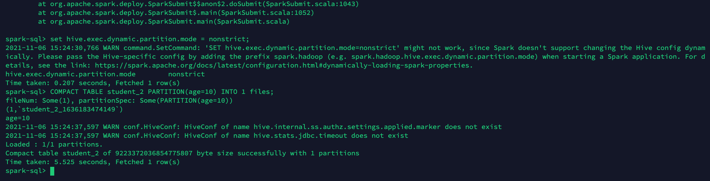

# 作业2 实现Compact Table command

- 要求:
添加compact table命令，用于合并小文件，例如表test1总共有50000个文件，
每个1MB，通过该命令，合成为500个文件，每个约100MB。
- 语法:
```sql
COMPACT TABLE table_identify [partitionSpec] [INTO fileNum FILES];
```
- 说明：
1. 如果添加partitionSpec，则只合并指定的partition目录的文件。
2. 如果不加into fileNum files，则把表中的文件合并成128MB大小。
3. 以上两个算附加要求，基本要求只需要完成以下功能:
```sql
COMPACT TABLE test1 INTO 500 FILES;
```

## 代码参考

SqlBase.g4:
```SqlBase.g4
| COMPACT TABLE target=tableIdentifier partitionSpec?
(INTO fileNum=INTEGER_VALUE identifier)? #compactTable
```

## 自己的解答

根据[AnalyzeTableCommand和LogicalPlanStats的说明](https://blog.csdn.net/wankunde/article/details/103623897)有2种不同的计算Table大小的方式
1. CommandUtils.calculateTotalSize(sparkSession, tableMeta)
2. LogicalPlanStats

经过源码阅读和网上找到的信息，理解为fileCompressionFactor的默认值为1，不另外设其他值的情况下的Analyze Table Command中调用的CommandUtils.calculateTotalSize的命令和LogicalPlanStats后面通过overide computeStats()方法计算的Stats(Statistics 类)最后就都是调用FileStatus.getLen()。

spark.sessionState.executePlan(df.queryExecution.logical).optimizedPlan.stats.sizeInBytes或spark.table(tbl).queryExecution.optimizedPlan.stats获取的的文件大小和spark-sql中运行DESC EXTENDED xxtable;的结果一致。

本地并行数受到线程数的影响，自己产生的数据表初始文件过小，而repartition命令产生的parquet文件估计每个都需要存储特定的受到列信息影响的元信息，尝试中没有产生小于512KB的文件。因此COMPACT TABLE命令没有into fileNum FILES参数时的自动分配的文件大小不能过小，否则无法稳定地产生预设的文件大小的文件。在本地调试中，暂时先设成1024B。以后有机会生成较大的表文件时再做修改和尝试。

修改的程序文件可以参考[CompactTableCommand](CompactTableCommand.scala)，[SparkSqlParser.scala](SparkSqlParser.scala)和[SqlBase.g4](SqlBase.g4)，最新2个版本的运行和结果如下


---

其他的运行和结果如下


---

## 助教-(张)彦功回答 2021/10/23

和课堂上讲的"SHOW MYUSER"和之前1次的作业(0829作业第3题)类似。实现可以参考0829课程《逻辑计划树和优化器、物理计划树和策略器》回放00:08分到00:25分的内容。我自己印象是5分不到开始，40分左右又演示了程序编译(build)后spark sql的操作效果

- 在 SqlBase.g4 增加 Compact Table 命令
- 在 SparkSqlParser.scala 增加 vistCompactTable 方法
- 在 commdand 目录下的 tables.scala (助教选择，也可以新建scala文件)增加 CompactTableCommand 类

参考文章：
1. [Spark Specific Partition Overwrite through Dataframe 用来解决1个partition合并小文件后如何重新覆盖包含其他 partition(s) 的原表](https://stackoverflow.com/questions/38487667/overwrite-specific-partitions-in-spark-dataframe-write-method)

### 编译和调试步骤及测试代码

1. 编译
```shell
./build/sbt package -Phive -Phive-thriftserver -DskipTests
```
或
```shell
./build/maven package -Phive -Phive-thriftserver -DskipTests
```

2. 运行

```shell
./bin/spark-sql
```

3. 添加表和数据, 在 spark-sql 命令中执行

```SQL
CREATE TABLE student (id BIGINT, name STRING) partitioned by (age INT) row format delimited fields terminated by ',' stored as textfile ;

CREATE TABLE student (id INT, name STRING, age INT);

CREATE TABLE student_2 (id INT, name STRING) partitioned by (age INT) row format delimited fields terminated by ',' stored as textfile ;
CREATE TABLE student_2 (id INT, name STRING) partitioned by (age INT);

set hive.exec.dynamic.partition = true;
set hive.exec.dynamic.partition.mode = nonstrict;

INSERT INTO student (id, name, age ) VALUES (1, 'a', 10);
INSERT INTO student (id, name, age ) VALUES (2, 'a', 20);
INSERT INTO student (id, name, age ) VALUES (3, 'a', 30);
INSERT INTO student (id, name, age ) VALUES (4, 'a', 10);
INSERT INTO student (id, name, age ) VALUES (5, 'a', 20);
INSERT INTO student (id, name, age ) VALUES (6, 'a', 30);
INSERT INTO student (id, name, age ) VALUES (7, 'a', 10);
INSERT INTO student (id, name, age ) VALUES (8, 'a', 20);

INSERT INTO student_2 (id, name, age ) VALUES (1, 'a', 10);
INSERT INTO student_2 (id, name, age ) VALUES (2, 'a', 20);
INSERT INTO student_2 (id, name, age ) VALUES (3, 'a', 30);
INSERT INTO student_2 (id, name, age ) VALUES (4, 'a', 10);
INSERT INTO student_2 (id, name, age ) VALUES (5, 'a', 20);
INSERT INTO student_2 (id, name, age ) VALUES (6, 'a', 30);
INSERT INTO student_2 (id, name, age ) VALUES (7, 'a', 10);
INSERT INTO student_2 (id, name, age ) VALUES (8, 'a', 20);

DESCRIBE TABLE FORMATTED student_2;

SHOW PARTITIONS student_2;
```

spark-sql> SHOW PARTITIONS student_2;
age=10
age=20
age=30

```SQL
COMPACT TABLE student_2 PARTITION(age=10) INTO 1 files;

COMPACT TABLE student INTO 1 files;
```

运行和结果如下





--

## 老师在1027课程中介绍的解决方法

代码可以参考 2021/10/27 课程 Delta Lake详解（下）02:00:00到02:02:10的视频 

Compact Table 命令:
CompactCommand (exec) sideeffect.run(
plan.(select) -> write -> partition？如果有partition，写到统一的临时目录 _temp -> rename(orginal renamed to _temp2, _temp renamed to original 担心操作有问题,把原始的表保存。如果中间操作失败就回滚，如果操作成功 _temp2 deleted)
)
