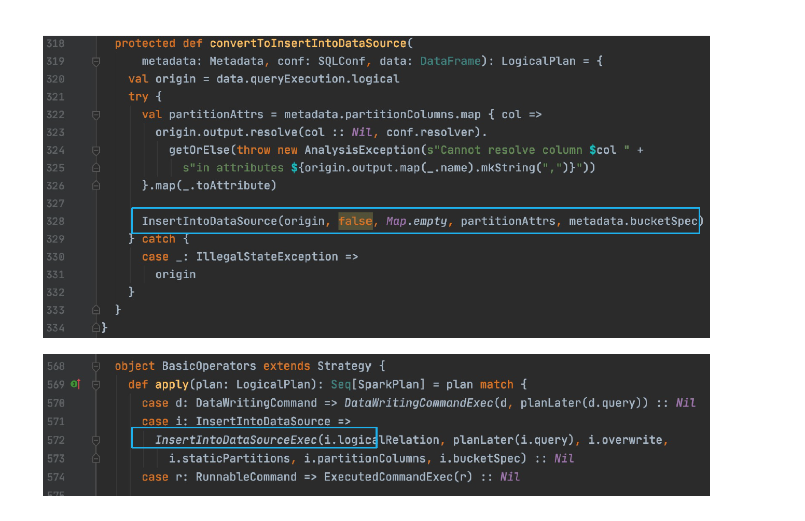
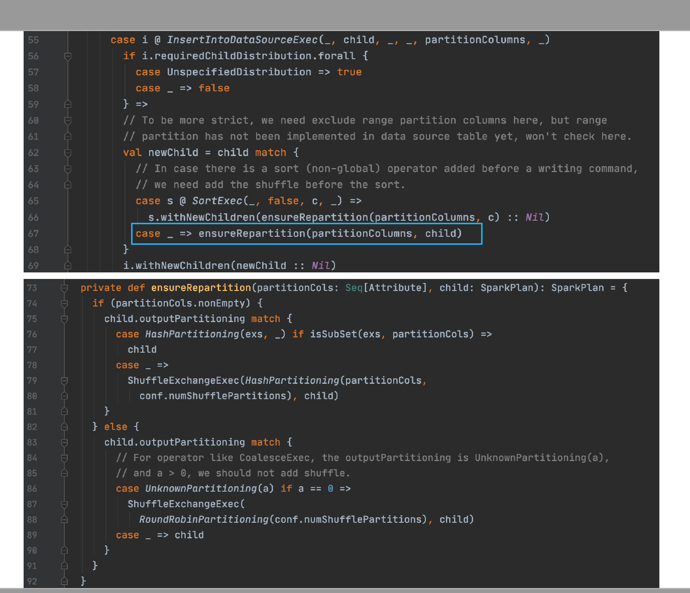

# 作业3 Insert命令自动合并小文件

- 我们讲过AQE可以自动调整reducer的个数，但是正常跑Insert命令不会自动合并小文件，例如
```sql
insert into t1 select * from t2;
  ```
- 请加一条物理规则（Strategy），让Insert命令自动进行小文件合并(repartition)。（不用考虑bucket表，不用考虑Hive表）

## 代码参考

```scala
object RepartitionForInsertion extends Rule[SparkPlan] {
override def apply(plan: SparkPlan): SparkPlan = {
plan transformDown {
case i @ InsertIntoDataSourceExec(child, _, _, partitionColumns, _)
...
val newChild = ...
i.withNewChildren(newChild :: Nil)
}
}
}
```

## 自己的解答


### Logical Plan的修改方法

可以参考[MyInsertOptimizerExtension](https://github.com/amoyyean/SparkMyOptimizerExtension/blob/master/src/main/scala/com/geektime/linyan/MyInsertOptimizerExtension.scala)和[RepartitionForInsertion](https://github.com/amoyyean/SparkMyOptimizerExtension/blob/master/src/main/scala/com/geektime/linyan/RepartitionForInsertion.scala)中的代码。


### Spark Plan的修改方法

生成1个SparkMyStrategyExtension.scala文件，内容如下

```scala
package com.geektime.linyan

import org.apache.spark.sql.SparkSessionExtensions

class SparkMyStrategyExtension extends (SparkSessionExtensions => Unit) {
  override def apply(extensions: SparkSessionExtensions): Unit = {
    extensions.injectPlannerStrategy { session =>
      RepartitionForInsertion(session)
    }
  }
}
```

生成1个RepartitionForInsertion.scala文件，内容如下

```scala
package com.geektime.linyan

import org.apache.spark.sql.SparkSession
import org.apache.spark.sql.execution.{CoalesceExec, SparkPlan}

object RepartitionForInsertion extends Rule[SparkPlan] {
override def apply(plan: SparkPlan): SparkPlan = {
plan transformDown {
case d: DataWritingCommand =>
DataWritingCommandExec(d, planLater(plan))
case i: InsertIntoDatasource => i.withNewChildren(CoalesceExec(1, planLater(plan)))
}
}
}
```

---

## 助教-(张)彦功回答 2021/10/23

- 写出去再读回来合并
  * 优点：控制写时的文件个数
  * 缺点：小文件还是产生了，读1次小文件再写1次
  * 助教讲授时说这个方法类似第2题 Compact Table 的情况，会用到 repartition

- 写出去时合并1
  * 根据某个 key 做 distribute by , 等于加了 shuffle
  * 缺点：如果上面的操作也有shuffle, key 不一致时可能造成两次 exchange

- 写出去时合并2
  * 在物理计划里判断上次(助教讲课时改成上游或上面)的物理计划
  * 非 partition 表，可以加 round robin partition
  * 是 partition 表但没有 partition 条件，可以加 hash partition
  * 助教讲课时提到还有1种情况是 partition 表，partition 条件是上游 partition 条件(1027课程里是上游，即child计划HashPartitioning的exs的子集)，可以不用加 partition
  * 我的理解有上游的原因是因为下面的sql命令select * from t2可以是一个复杂的sql select查询，里面可能有多层包含不同 partition 的物理执行计划
  ```sql
  insert into t1 select * from t2;
  ```  
  * 助教讲授时说这个方法是老师在 ebay 的优化方案

参考文章：
1. [Apache Hudi如何智能处理小文件问题](https://www.cnblogs.com/leesf456/p/14642991.html)。助教说由于太复杂未尝试Hudi的解决方法

---

## 老师在 eBay INSERT INTO 自动合并小文件及写入数据时自动合并小文件的方法

代码可以参考 2021/10/27 课程 Delta Lake详解（下）01:21:32到01:33:55的视频和课件 17DeltaLake[1024带笔记]-极客时间训练营 的第80到83页的内容
另外简要的实现方案可以参考 2021/10/27 课程 Delta Lake详解（下）01:53:25到02:00:00的视频

运行和结果如下






(df) -> logical plan (select xx from, 即 insert into 后面的语句) -> INSERT(child = logical plan，即select语句那部分的plan) -> strategy (INSERT -> INSERT_EXEC INSERT_EXEC是1个 physical plan ) -> INSERT_EXEC.child(之前select语句的logical plan对应的physical plan)(select xx)，这一步老师一开始描述是再加1个plan 遍历物理计划树 -> repartition (child的ouputPartitioning？满足什么都不做，不满足加ExchangeExec ) -> INSERT_EXEC(child(加过EXCHANGE_EXEC的物理计划)) -> writeFiles(这里面可能有overwrite机制)

df.repartition(xxx).write.mode(SaveMode.Overwrite)这个是从应用层实现的，上面是从计划层实现的

